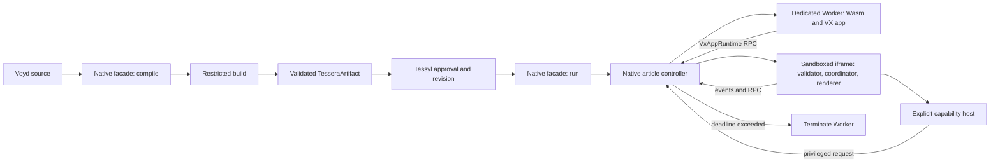

# Tessyl Native architecture and security

This document is the implementation guide for Tessyl Native maintainers. It
defines the required trust boundaries and the minimum complete path from Voyd
source to an interactive Tessera embedded in an article.

## Design summary

Tessyl Native reuses VX's `Program<Model, Msg>` lifecycle but does not run a
Tessera like a normal trusted browser application.

- Tessyl Native compiles and validates portable artifacts; Tessyl owns their
  approval, storage, revisioning, and publication.
- Tessyl calls a single private Native integration facade; the compiler,
  runtime topology, and security machinery behind it are not Tessyl APIs.
- A dedicated Worker owns the untrusted Wasm instance and VX application state.
- A sandboxed iframe owns trusted VX coordination and DOM rendering.
- The parent article owns artifact selection, Worker termination, and privileged
  actions.
- Every message, frame, command, subscription, and event crosses a validated,
  versioned protocol.



## Security objectives

A Tessera must not be able to:

- Read or mutate the article DOM.
- Obtain browser, network, storage, credential, or cross-origin authority unless
  a future capability explicitly grants a narrower operation.
- Navigate, submit forms, open windows, or load arbitrary resources.
- Block the article's main thread with Wasm execution.
- Emit an unbounded render tree, command graph, event queue, or subscription set.
- Affect another Tessera's state or survive its own disposal.
- Replace its source, artifact, capability profile, or pinned revision after
  publication.

The system should contain, report, and recover from infinite loops, traps,
allocation storms, malformed protocol messages, renderer amplification, and
capability abuse. Browser engine compromise is outside the application-level
threat model, but browser isolation primitives should be used defensively.

## Trust boundaries

| Component | Trusted? | Authority |
| --- | --- | --- |
| Voyd source and Wasm | No | Computation only through supplied imports |
| Native build service | Yes | Compile, validate, and emit portable artifacts |
| Tessyl product service | Yes | Authorize, store, review, version, and publish artifacts |
| Native integration facade | Yes | Expose compile, initialize, and run to Tessyl |
| Native article controller | Yes | Validate artifact, broker messages, kill Worker |
| Worker bootstrap | Yes | Instantiate the approved Wasm with a restricted host |
| Native protocol validator | Yes | Reject data before trusted consumers use it |
| Renderer iframe bundle | Yes | Render validated frames and run approved capabilities |
| Tessera frame/commands/events | No | Data only |
| Static fallback | Reviewed data | Restricted static native frame rendered by trusted code |

Contributor or AI review status changes publication policy, not runtime trust.
All tiers use the same containment model.

## Repository packages

```text
packages/tessyl-native/
  voyd/                 Voyd-facing Tessera types and components
  src/index.ts          Tessyl-facing integration facade
  src/protocol/         Shared schemas, validation, and limits
  src/controller/       Private lifecycle, broker, watchdog, and recovery
  src/worker/           Wasm/VX bootstrap and RPC implementation
  src/renderer/         Sandboxed frame entrypoint and capability host
  src/build/            Compilation policy, manifest, and artifact validation
  docs/                 Product, author SDK, integration SDK, and architecture
```

The implementation may split these into packages when independent versioning or
bundling becomes useful. Start together so protocol changes remain atomic.

## Package and API boundary

Only Tessyl installs `@tessyl/native`. Untrusted Voyd source imports the pinned
`pkg::tessyl_native` package supplied by the restricted build; it cannot import
the TypeScript package.

Trusted Tessyl code integrates through `createTessylNative` and its `compile`,
`initialize`, and `run` operations. Those operations own the complete secure
path described by this document. Internal modules are not package exports, and
Tessyl must not instantiate a Voyd host, VX runtime, Worker, iframe, protocol
broker, capability host, or watchdog directly. See the
[Tessyl Integration SDK](./tessyl-integration-sdk.md) for the facade contract.

Compiler implementation can remain server-only and runtime implementation
browser-only through environment-specific bundling behind the facade. This is
a packaging constraint, not a reason to expose separate low-level APIs.

## Build and Tessyl handoff pipeline

Only Native-build-produced Wasm is executable. Never accept contributor-supplied
Wasm as a runnable artifact. Tessyl enters this pipeline through
`native.compile`; all following steps are owned by Native.

1. Store source and declared asset inputs.
2. Compile in a process/container with wall-time, CPU, memory, file, and output
   limits.
3. Resolve packages from an allowlist. Application modules may import
   `pkg::tessyl_native` and approved pure libraries, but not low-level VX,
   external interfaces, or arbitrary packages.
4. Record every transitive package at an exact version and content hash in a
   canonical dependency lock; bind the lock hash to the artifact manifest.
5. Compile with only the required boundary exports and diagnostics.
6. Inspect the emitted effect/external-requirements metadata and the final
   `WebAssembly.Module.imports()` result.
7. Reject unexpected imports/exports, absent or excessive memory/table maxima,
   shared memory, incompatible features, excessive module structure, and
   oversized artifacts.
8. Capture a default-state native frame in the restricted preview. Project
   controls into non-focusable labelled values, remove buttons, links, events,
   and other interactive semantics, validate it against the static-frame schema
   and limits, and submit it for review. Chart-data disclosures become
   always-expanded, non-focusable tables. Raw contributor HTML is never accepted.
9. Produce a versioned `TesseraArtifact`, including manifest, component hashes,
   build provenance, dependency lock, and validated fallback.
10. Hand the artifact to Tessyl. Tessyl assigns its content identity, ownership,
   review state, permissions, persistence, and article relationships, and binds
   an approved artifact immutably to any published revision. The server, not
   contributor-controlled data, assigns capability and resource profiles.

The Node wrapper admits only the profile's bounded number of compiler children,
uses a bounded queue with a wait deadline, strips ambient environment variables,
and applies Node permission, V8 heap, output, and wall-time limits. Production
deployments must additionally run the build service in an OS/container cgroup
with an RSS and CPU quota; the V8 heap flag does not bound Binaryen or native
allocations.

No Voyd compiler changes are required initially. The Native build wrapper owns
compiler and artifact policy. Tessyl owns review and publication policy. Richer
compiler metadata and diagnostics can be added later without becoming the
runtime security boundary.

### Artifact manifest

```ts
type TesseraManifestV2 = {
  schemaVersion: 2;
  frameProtocolVersion: 1;
  rpcProtocolVersion: 1;
  sdkVersion: "2";
  vxRuntimeVersion: string;
  compilerVersion: string;
  sourceHash: string;
  dependencyLockHash: string;
  wasmHash: string;
  fallbackHash: string;
  buildProvenanceHash: string;
  metadataHash: string;
  resourcesHash: string;
  entrypoint: "app";
  capabilityProfile: "public-v2";
  resourceProfile: "standard-v1";
};

type TesseraArtifactV2 = {
  manifest: TesseraManifestV2;
  wasm: Uint8Array;
  sourceBundle: Uint8Array;
  dependencyLock: TesseraDependencyLockV1;
  fallback: NativeStaticFrameV1;
  buildProvenance: NativeBuildProvenanceV1;
  metadata: TesseraMetadataV1;
  resources: TesseraResourceContractV1;
};
```

The stored `TesseraDependencyLockV1` lists each direct and transitive package,
its exact version, and its content hash. Rebuilds use only content matching that
lock. The source bundle includes all application-owned modules, so source,
dependencies, compiler, and SDK fully identify the reviewed build input.

The artifact manifest binds the Wasm, source bundle, dependency lock, fallback,
and build provenance. Tessyl then binds the approved artifact hash to its own
revision record. The client verifies hashes before instantiation. Signing is
useful for artifact distribution and offline verification but does not replace
Tessyl authorization or content security policy.

`resourceProfile` names a normative, immutable limits table used by check,
preview, build, and runtime. Limit changes require a new profile version; do not
silently reinterpret an existing published revision. Emergency revocation may
prevent a vulnerable profile or revision from starting, in which case the
client renders its fallback.

## Runtime topology

### Parent article controller

The controller is a private implementation behind `native.initialize` and
`native.run`. It is the root of the runtime lifecycle and:

- Fetches the pinned manifest and artifact from the Tessyl origin.
- Receives an artifact authorized by Tessyl, then checks versions, hashes, and
  sizes before execution.
- Creates a sandboxed renderer iframe and a dedicated Worker.
- Brokers all iframe/Worker messages so the watchdog sees every operation.
- Assigns monotonically increasing request IDs and a Worker generation ID.
- Enforces one in-flight state transition per Tessera and a bounded event queue.
- Terminates the Worker on timeout, protocol violation, disposal, or revision
  replacement.
- Shows fallback, loading, error, restart, and expanded-view states.
- Enforces a page-level limit on active Workers and pauses or disposes offscreen
  Tesserae.

The controller does not interpret application domain state.

### Worker

The Worker receives approved bytes and manifest data, then creates the following
internally; this is not a Tessyl-facing integration API:

```ts
const voydHost = await createVoydHost({
  wasm,
  defaultAdapters: false,
  bufferSize: limits.boundaryBytes,
});

const app = createVoydVxAppRuntime({ host: voydHost });
```

The Worker exposes only the `VxAppRuntime` operations needed by the renderer
proxy: `init`, `render`, `dispatch`, retained-handler release, and `dispose`.
Application snapshots are not transmitted in v1; the trusted bootstrap removes
the `snapshot` field from runtime steps before validation. The Worker has no DOM
reference and receives no Tessyl credentials. Do not install default Voyd
adapters or contributor-provided JavaScript adapters.

Each RPC response is plain protocol data. Before calling `postMessage`, the
trusted Worker bootstrap performs a bounded traversal that validates the full
runtime step and its configured size/count limits. This is necessary because
structured cloning allocates before the receiving parent can inspect the value.
The bootstrap likewise validates bounded inbound dispatch payloads before
calling the application.
The Worker cannot send a message directly to the iframe; the parent broker then
checks channel binding, generation, request ID, message kind, and outer envelope
limits.

### Renderer iframe

The iframe loads only Tessyl's trusted renderer bundle. It creates a remote
`VxAppRuntime` proxy whose methods call the Worker through the parent broker.
Before resolving a proxy call, it validates the entire runtime step: frame,
commands, subscriptions, nesting, and size.

The iframe then reuses VX coordination:

```ts
await mountVxApp({
  container,
  app: validatedWorkerProxy,
  runtimeHostMode: "explicit",
  runtimeHost: createTessylCapabilityHost(capabilityProfile),
});
```

`runtimeHostMode: "explicit"` is expected to use exactly the supplied commands,
subscriptions, and error handler. Until that upstream option is available, the
native renderer must use an equivalent Tessyl-owned coordinator; it must not
call the default browser runtime host and attempt to subtract capabilities.

The iframe sandbox must omit same-origin, forms, popups, downloads, pointer
lock, and top-navigation privileges. Its content security policy permits only
the fixed renderer resources required to start, with no application-controlled
script, styles, frames, connections, or resource URLs. Exact policy should be
verified in every supported browser rather than inferred from the sandbox
attribute alone.

The parent creates a dedicated `MessageChannel` for the Worker and another for
the iframe, binds both ports to one Tessera and Worker generation, and brokers
between them. Runtime traffic is accepted only on those transferred ports;
global `message` events are not a runtime transport. The one-time iframe port
transfer is accepted only from `window.parent`, after which the bootstrap
listener is removed. Request IDs are monotonic within a generation, and stale,
duplicate, or unexpected replies are rejected.

## The two host layers

Voyd and VX have different host concepts; implementation names must keep them
distinct.

1. **Wasm host:** `createVoydHost` runs exported functions and links Voyd
   effects/adapters. Tessyl always uses `defaultAdapters: false` and an exact
   import policy.
2. **Capability host:** VX executes leaf commands and subscriptions. Tessyl
   supplies only the entries named by the artifact's server-assigned profile.

Structural VX operations such as command `none`, `message`, `batch`, and `map`
remain part of coordination. Unknown leaf commands or subscriptions fail
closed. A capability profile is a server-owned mapping to concrete trusted
handlers, never a set of functions or permissions supplied by the Tessera.

### Public v2 capabilities

- Bounded delay.
- Rate-limited animation frames, paused offscreen and under reduced motion.
- Deterministic fixed-timestep simulation with bounded catch-up.
- Live reduced-motion state.
- Container-size observation scoped to the iframe.
- Manifest-declared typed inputs and hash-pinned dataset text.
- Bounded initial deep-link state and host-observed share-state publication.

Reader-initiated article navigation is a native renderer feature, not an
application command. `ArticleLink` carries a validated Tessyl slug in the frame;
only the trusted direct click/keyboard handler may ask the parent to navigate.
Application lifecycle code, timers, and subscriptions cannot trigger it.

There is no arbitrary fetch, storage, clipboard read, browser navigation,
global keyboard listener, broadcast channel, cross-Tessera channel, or dynamic
adapter registration.

## Native render protocol

Use a discriminated, versioned protocol. It may encode a restricted VX frame,
but generic VX syntax is not the policy.

```ts
type NativeFrameV1 = {
  version: 1;
  root: NativeNode;
};
```

The validator applies tag-specific schemas and rejects unknown fields. It must
bound work while parsing; do not first normalize or clone an arbitrarily large
tree and validate it afterward.

### Allowed surface

- Text, fragment, and a curated set of semantic HTML elements.
- Safe input types and properties.
- Required ARIA and semantic attributes.
- Tessyl-owned style tokens.
- A curated SVG subset used by native chart and diagram components.
- Known local events with normalized, size-limited payloads.

### Rejected surface

- Script, iframe, object, embed, form submission, media/resource loading, and
  SVG `foreignObject`.
- Raw style, arbitrary class names, arbitrary properties, `innerHTML`, URL
  attributes, external references, and unknown namespaces.
- Unknown events, commands, subscriptions, options, or protocol fields.
- Non-finite numbers, invalid Unicode policy where applicable, and cyclic data.

### Limits

Each versioned resource profile sets maximum encoded bytes, boundary containers,
boundary entries and depth, nodes, children per node, attributes per node,
string length, event handlers, command nesting, outstanding delayed effects,
subscriptions, table cells, and plotted points. Validation errors
include a bounded field path for diagnostics but do not echo attacker-sized
values.

Validation occurs first in the trusted Worker bootstrap before structured
cloning, then again at the renderer boundary. The first pass protects the
broker and main process from application-sized results; the second protects the
coordinator and DOM consumer. The parent validates the small outer envelope and
channel state rather than traversing an already-cloned attacker-sized tree.

## Event and RPC protocol

Messages use a closed union with protocol version, Tessera ID, Worker
generation, request ID, and kind. Representative operations are:

```text
Parent -> Worker: boot, init, render, dispatch, release_handlers, dispose
Worker -> Parent: result, runtime_error, ready
Iframe -> Parent: app_rpc, article_link_activation, renderer_ready
Parent -> Iframe: app_result, app_error, capability_result, terminate
```

- Accept only expected responses for an active request and generation.
- Accept runtime traffic only on parent-created ports bound to that Tessera and
  generation; never route by an application-supplied ID alone.
- Ignore late responses from terminated generations.
- Never deserialize functions, prototypes, transferables, or arbitrary message
  ports from application-controlled data.
- Normalize browser events in trusted code and send only fields required by the
  registered native event.
- Coalesce pointer, input, resize, and animation activity where intermediate
  values are not meaningful.
- Bound queues and reject or replace excess events rather than allowing memory
  growth.
- Bound and expire the page-level Worker admission queue so excess placements
  cannot retain unlimited controllers, channels, and sandbox frames.

The parent applies rolling per-Tessera quotas to every brokered dispatch RPC and
emitted frame, regardless of whether it originated from an event, command, or
subscription. It also limits consecutive requests without an idle turn and
delays forwarding after a bounded batch so the event loop can run. Subscription
handlers have source-specific rate limits. Exceeding any quota terminates the
Worker generation and shows the standard resource error, containing an infinite
chain of individually fast transitions without requiring dispatch-cause hooks
from VX.

## Resource containment

### CPU

Wasm execution occurs only in the dedicated Worker. The parent starts a
wall-clock deadline for every `init`, `render`, and `dispatch` RPC. When the
deadline callback runs, it terminates the Worker, invalidates the generation,
disposes the iframe runtime, and exposes a restart action.

Browser artifact admission parses and caps Wasm section and resource counts
without invoking the engine on the main thread. Engine validation and
compilation occur only in the disposable runtime Worker under its startup/RPC
deadline. The server performs the same work inside its restricted compiler
child process.

Budgets apply per RPC and through rolling transition/frame quotas. A profile may
define explicit supported device classes, but its selection rules and limits
are immutable; tuning produces a new resource-profile version.

Background-tab scheduling must not create false abuse signals; the controller
stops forwarding events and pauses subscriptions when the document becomes
hidden. On `visibilitychange` to hidden, `pagehide`, or a supported page-lifecycle
freeze event, it terminates any generation with an in-flight RPC before the page
backgrounds. An idle generation may remain paused; a terminated generation
restarts from `init` when activated again.

Browser scheduling means timer deadlines are best-effort containment, not a
real-time guarantee. The lifecycle handlers reduce the window in which a frozen
page can strand active computation, and background/freeze behavior is part of
the cross-browser hostile test suite.

### Memory

Enforce Wasm, message, source, static-data, queue, frame, and concurrency limits.
Every declared or imported linear memory and table must have a maximum no larger
than its profile limit; reject an artifact with an absent or excessive maximum.
For an imported memory or table, the trusted host creates it with the validated
maximum rather than accepting an application-provided object. Reject shared
memory and unsupported memory modes. Wasm-GC allocation has no reliable
per-instance browser quota, so termination remains the primary recovery
mechanism for an allocation storm. Keep the watchdog short, run one Tessera per
Worker, and test allocation pressure across supported browsers.

Do not add compiler fuel or GC-allocation instrumentation for v2. Reconsider a
per-operation allocation counter only if production-like hostile tests show
unacceptable process-level memory spikes before termination.

### Rendering and messaging

Render only one validated complete frame per transition. Do not expose a
streaming DOM-patch import to Wasm. Limit active subscriptions, command graphs,
retained handlers, pending RPCs, and concurrent Workers. Release retained
handlers when the trusted renderer removes them and release all state on
disposal.

## Lifecycle and recovery

```text
fallback -> loading -> initialized -> starting -> running
                    \-> unsupported
                    \-> failed -> restart -> initialized -> starting -> running
running -> reset -> initialized -> starting -> running
running -> paused/offscreen -> starting -> running
running -> disposed
```

The static fallback exists outside the untrusted runtime and remains available
throughout startup. A failure replaces only that Tessera's interactive surface.
Restart creates a fresh Worker generation and initial model; v2 does not restore
ephemeral application state after a crash.

The standard shell's Reset action uses the same fresh-generation path during
normal operation: terminate the Worker, dispose renderer state and
subscriptions, create a new generation, and rerun `init`. It is distinct from
an optional domain-specific partial reset implemented by application messages.

Avoid starting every embedded Worker at page load. Use viewport proximity and a
page-level active limit. Never pool untrusted Tesserae into one Worker because
that removes per-application termination.

## Versioning and compatibility

Version these independently in the manifest:

- Tessera Author SDK.
- Tessyl Integration SDK.
- Native frame/RPC protocol.
- VX runtime ABI.
- Voyd compiler.
- Capability and resource profiles.

The client starts an artifact only when it supports the complete version tuple.
Published revisions are immutable; migrations create new revisions. Keep a
compatibility window or render the fallback when an old revision can no longer
run safely.

## Observability and privacy

Record bounded operational events: startup result, operation phase and
duration, timeout, trap category, protocol rejection category, frame-size
bucket, and restart. Do not record model values, user-entered text, source, or
full attacker-controlled error payloads by default.

Correlate events with Tessera revision, runtime version, browser family, and a
non-sensitive request identifier. Rate-limit reports so a broken Tessera cannot
become a logging denial of service.

## Required tests

### Build policy

- Reject forbidden packages, effects, imports, exports, shared memory,
  memory/table declarations without acceptable maxima, oversized artifacts,
  incompatible versions, dependency-lock drift, and hash mismatches.

### Worker containment

- Infinite loop, recursive stack overflow, trap, rapid allocation, oversized
  boundary result rejected before `postMessage`, late response after
  termination, endless immediate-message chain, hidden/frozen page during an
  in-flight RPC, and repeated restart.

### Protocol and renderer

- Unknown message kinds and fields, excessive nesting, excessive node and
  command counts, cyclic objects, huge strings, non-finite numbers, unsafe HTML
  and SVG surface, malformed events, stale generations, duplicate replies,
  global-message spoofing, cross-Tessera port use, and renderer disposal.

### Capabilities

- Every allowed command/subscription, every default browser capability being
  absent, unknown capability failure, validation of privileged requests, and
  cleanup after timeout/disposal.

### Product behavior

- Static fallback, lazy activation, keyboard navigation, reduced motion,
  narrow layout, offscreen pause, independent failure of multiple Tesserae,
  no-script rendering, shell reset, and unsupported-version behavior.
- Charts expose an accessible name, bounded description, and profile-limited
  tabular representation of the plotted data in semantic and browser tests.
- Static fallbacks contain no focusable controls or links and have a coherent
  screen-reader order after interactive controls are projected to labelled
  values; chart-data tables remain available without disclosure controls.

Run hostile runtime tests in Chrome, Firefox, and Safari because termination,
memory pressure, iframe sandboxing, and scheduling behavior are embedder
specific.

## Implementation sequence

1. Define the Tessyl integration facade plus versioned manifest, RPC, frame
   schemas, validators, and resource profiles before rendering untrusted
   output.
2. Implement build policy, artifact production, and the handoff contract to
   Tessyl-owned storage and publication.
3. Implement `initialize` and `run` over Worker-hosted
   `createVoydVxAppRuntime` and parent-brokered RPC with watchdog termination.
4. Implement the sandboxed iframe, validated remote app proxy, explicit VX
   runtime host, and renderer.
5. Implement fallback, restart, lazy activation, disposal, and active limits.
6. Add the minimal Voyd SDK types and native components, beginning with layout,
   text, controls, metrics, and one chart.
7. Complete hostile, accessibility, and cross-browser test matrices before
   enabling publication.
8. Add capabilities one at a time with SDK, protocol, policy, limit, audit, and
   failure semantics in the same change.

## Security review checklist

Before public launch, verify:

- No path instantiates Wasm that Tessyl has not authorized and bound to a
  published revision.
- Both host layers default to no ambient capability.
- Every untrusted-to-trusted boundary validates before allocation-heavy work or
  side effects.
- Worker RPC cannot bypass the parent watchdog.
- The iframe cannot access the article origin, navigate, submit, fetch arbitrary
  resources, or load application-controlled code/style.
- One Tessera can be terminated without affecting another or the article.
- Static output remains useful when all interactive execution is disabled.
- Operational logs do not capture sensitive application or reader data.
- Version rejection and emergency capability/profile revocation are tested.
